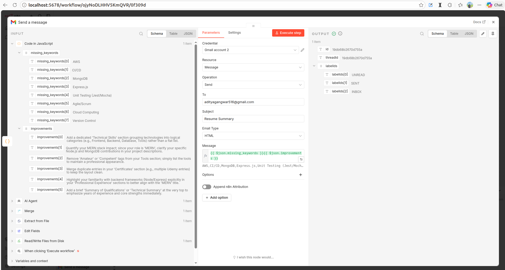

# 🧠 AI Resume Optimizer (n8n Workflow)

## 🚀 Use Case

Applying to jobs with the same resume rarely works anymore. Most companies use ATS (Applicant Tracking Systems) to filter resumes based on keywords from the job description.

This workflow automates that process.

What it does:

* Reads your resume (PDF)
* Extracts the content
* Compares it with a job description
* Finds missing keywords
* Suggests improvements
* 📩 Sends the result directly to your email

### 🎯 Who this is for

* Developers applying to multiple jobs
* Job seekers struggling with ATS filtering
* Freelancers optimizing resumes for clients

---

## 🤖 LLM Used

* **Model:** Google Gemini (Gemini Chat Model)

### Why I chose it:

* Fast and cost-effective
* Good at comparing structured text
* Reliable for generating JSON output
* Easy to integrate with n8n

---

## 🛠️ Tools Used

| Node                       | What it does                      |
| -------------------------- | --------------------------------- |
| Manual Trigger             | Starts the workflow               |
| Read/Write Files from Disk | Reads resume from system          |
| Extract from File          | Extracts text from PDF            |
| Edit Fields                | Adds job description              |
| Merge Node                 | Combines resume + job description |
| Google Gemini Chat Model   | Generates analysis                |
| AI Agent                   | Controls AI behavior              |
| Function Node              | Parses output into JSON           |
| Gmail Node                 | Sends results to email            |

---

## 🧠 Memory Used

Memory is not implemented yet.

### How it can improve:

* Store previous resume analyses
* Track improvements over time
* Avoid repeating suggestions
* Personalize recommendations

Right now, every run is independent.

---

## 🖼️ Workflow Screenshot


## ⚡ Agent in Action

### 📌 Example 1: Resume Analysis


**Output:**

```json id="r0twq8"
{
  "missing_keywords": ["Docker", "CI/CD"],
  "improvements": [
    "Add Docker experience",
    "Mention CI/CD pipelines"
  ]
}
```

---

### 📌 Example 2: Email Delivery



The agent sends:

* Missing keywords
* Suggested improvements
* Clean formatted result

directly to your Gmail inbox.

---

## 🪞 Reflection

### What does your agent do well?

It does a good job at quickly analyzing resumes and pointing out what’s missing.
The biggest advantage is automation — instead of manually comparing resumes with job descriptions, everything is handled in seconds.

The email feature makes it even more useful since results are delivered instantly without checking logs.

---

### What are its current limitations?

* Depends on accurate PDF text extraction
* AI sometimes gives slightly generic suggestions
* No memory (doesn’t learn from past results)
* Needs manual job description input

---

### What would you improve or extend with more time?

* Add ATS score (0–100 rating)
* Auto-rewrite resume sections
* Build frontend UI for uploads
* Store results in database
* Add job scraping (auto-fetch JD)

---

### How does memory improve the agent's usefulness in your use case?

Memory would make this feel like a real assistant instead of a one-time tool.

It could:

* Track previous suggestions
* Avoid repeating the same feedback
* Improve recommendations over time
* Help users see progress

---

### Did the tool behave as expected? Were there any edge cases?

Mostly yes, but some issues came up:

* Docker file path problems
* Merge node not combining inputs initially
* AI output not always valid JSON
* Agent not running due to missing connections

Edge cases:

* Poor PDF formatting
* Very long resumes
* Weak job descriptions

All of these were fixed with better setup and stricter prompts.

---

## 📚 Core Concept Questions

### 1. What is the difference between a simple LLM call and an LLM-powered agent?

A simple LLM call is just input → output.

An agent is more advanced — it can:

* Use tools
* Execute steps
* Process data
* Handle workflows

---

### 2. What role does the system prompt play in shaping agent behaviour?

It defines how the AI behaves.

It controls:

* Output format
* Task focus
* Response style

In this project, it ensures structured JSON output.

---

### 3. How does tool use extend what an LLM can do on its own?

LLMs can only generate text.

Tools allow them to:

* Read files
* Process inputs
* Send emails
* Automate workflows

That’s what makes this project practical.

---

### 4. What are the trade-offs between short-term and long-term memory?

Short-term:

* Fast
* Temporary

Long-term:

* Persistent
* More useful but complex

---

### 5. What is the purpose of the AI Agent node in n8n compared to a simple LLM Chain node?

AI Agent:

* Supports tools and logic
* More flexible

LLM Chain:

* Simple text generation

---

### 6. What risks or failure modes did you observe?

* File access errors
* Merge node issues
* Invalid JSON from AI
* Connection misconfigurations

---

### 7. How would you evaluate performance in production?

* Accuracy of suggestions
* Consistency of output
* Response time
* User feedback
* Success rate in job applications

---

## 🏁 Conclusion

This project shows how you can use **n8n + AI + Gmail** to build a real, useful automation tool.

It’s simple, but with a lot of potential to grow into a full product.

---

## 🔥 Future Scope

* ATS scoring system
* Resume auto-rewriter
* Frontend UI
* Database + memory
* Job scraping integration

---
